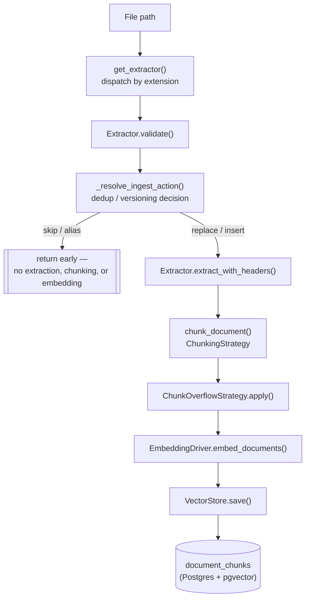
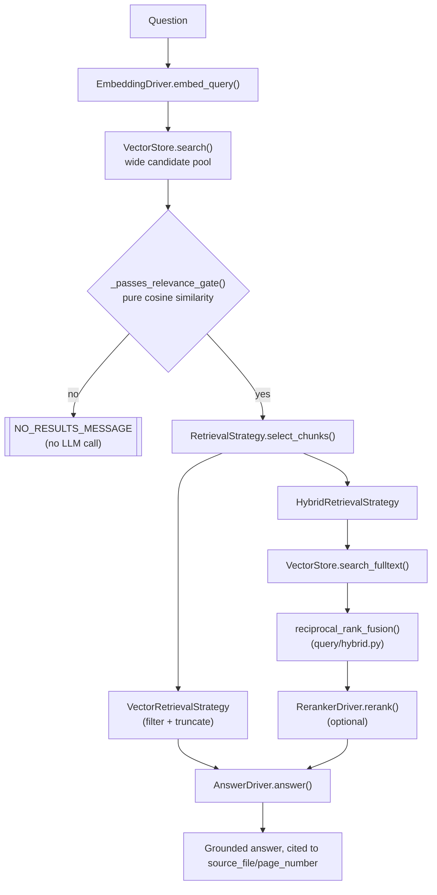
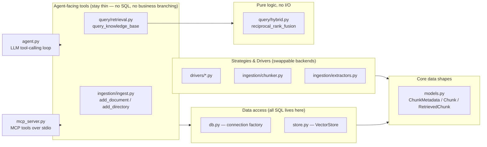

# Architecture

A structural map of how a document becomes searchable, and how a question becomes an answer — the shape of the pipeline, not its current defaults or the reasoning behind them.

This file stays deliberately free of specific numbers (chunk sizes, thresholds, model names) so it doesn't drift out of sync the way prose descriptions do. For "what's the default right now," see `README.md`. For "why is it that default," see `docs/decisions.md`.

## Ingestion: `add_document()` (`ingestion/ingest.py`)

`add_directory()` runs this same flow per file, collecting an ingested/updated/aliased/skipped/failed summary instead of raising on the first already-present file.

## Retrieval & answering: `query_knowledge_base()` (`query/retrieval.py`)

The relevance gate always runs on plain cosine similarity, regardless of which `RetrievalStrategy` is active — hybrid/rerank scores live on different, non-comparable scales, so they're never used as the "is there a reliable source at all" check. See `docs/decisions.md` for why.

## Strategy / Driver selection

Every swappable backend in this project follows the same shape: an ABC, one or more concrete implementations, and a `@lru_cache`d factory function that reads the active choice. All but one are chosen via `.env`.

| What varies | ABC | Implementations | Chosen by | Factory |
|---|---|---|---|---|
| Embedding backend | `EmbeddingDriver` | `LocalSentenceTransformerDriver`, `OpenAIEmbeddingDriver` | `EMBEDDING_DRIVER` | `get_embedding_driver()` (`drivers/embedding.py`) |
| Answer generation | `AnswerDriver` | `OpenRouterAnswerDriver`, `OpenAIAnswerDriver` | `LLM_DRIVER` | `get_answer_driver()` (`drivers/llm.py`) |
| Reranking | `RerankerDriver` | `NoopRerankerDriver`, `CrossEncoderRerankerDriver` | `RERANKER_DRIVER` | `get_reranker_driver()` (`drivers/reranker.py`) |
| Final chunk selection | `RetrievalStrategy` | `VectorRetrievalStrategy`, `HybridRetrievalStrategy` | `RETRIEVAL_STRATEGY` | `get_retrieval_strategy()` (`query/retrieval.py`) |
| How a document is split into chunks | `ChunkingStrategy` | `WordChunkingStrategy`, `LangChainChunkingStrategy` | `CHUNKING_STRATEGY` | `get_chunking_strategy()` (`ingestion/chunker.py`) |
| What happens to an over-limit chunk | `ChunkOverflowStrategy` | `WarnOverflowStrategy`, `SplitOverflowStrategy` | `CHUNK_OVERFLOW_STRATEGY` | `get_chunk_overflow_strategy()` (`ingestion/chunker.py`) |
| Document text extraction | `Extractor` | `PDFExtractor`, `MarkdownExtractor` | **the file's extension** — the one deliberate exception; see `AGENTS.md` | `get_extractor(path)` (`ingestion/extractors.py`) |

## Module responsibilities

`agent.py` and `mcp_server.py` are two independent front doors onto the same two tools (`add_document`/`add_directory`, `query_knowledge_base`) — neither one contains pipeline logic of its own.

## Where to look next

- **Current defaults, benchmark numbers, setup instructions:** `README.md`
- **Why a default/threshold is what it is, rejected alternatives, bugs found via real testing:** `docs/decisions.md`
- **Code conventions, SRP/DDD stance, per-file documentation rules:** `AGENTS.md`
