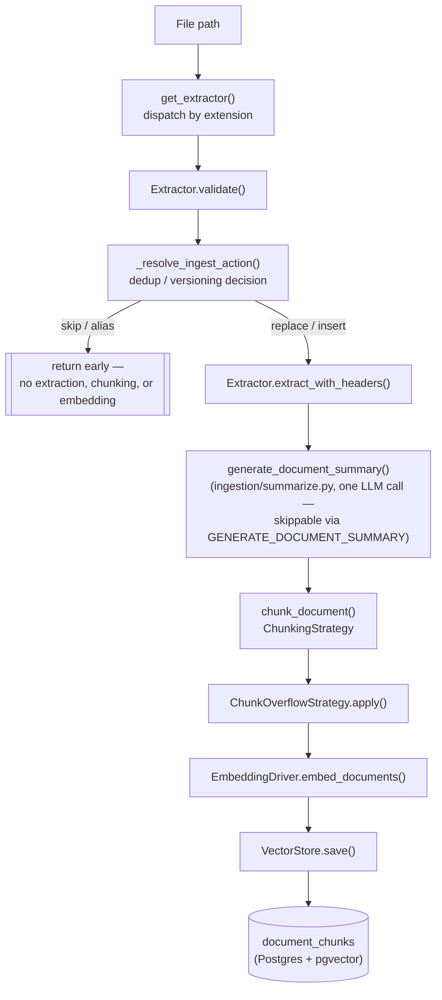
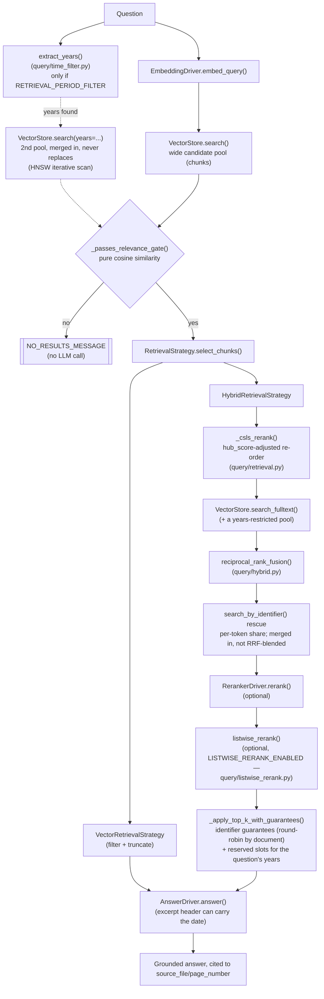
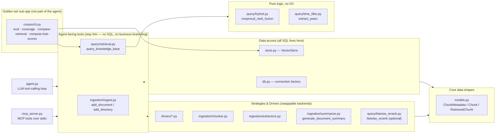

# Architecture

A structural map of how a document becomes searchable, and how a question becomes an answer -- the shape of the pipeline, plus one quick index of every switch ([Switches](#switches-what-each-one-does-and-what-we-measured)).

Everything above that index stays free of specific numbers so it doesn't drift out of sync. The Switches section is the one deliberate exception: it lists each default and the *measured* effect of each switch, **with the date of the measurement**, as a signpost. It is a summary, not the source -- `README.md` is the source for current defaults and `docs/decisions.md` for the reasoning, the numbers and the rejected alternatives. If this file and `decisions.md` disagree, `decisions.md` wins.

## Ingestion: `add_document()` (`ingestion/ingest.py`)

`add_directory()` runs this same flow per file, collecting an ingested/updated/aliased/skipped/failed summary instead of raising on the first already-present file.

`VectorStore.compute_hub_scores()` is a separate, decoupled batch pass over the whole corpus (not part of the per-document flow above) — run it after a bulk ingest to (re)populate every chunk's `hub_score`, used by retrieval's CSLS re-ranking below. Idempotent; safe to re-run after any corpus change.

## Retrieval & answering: `query_knowledge_base()` (`query/retrieval.py`)

Dashed edges and the "years" nodes only exist when `RETRIEVAL_PERIOD_FILTER` is on. Everything else is always part of the default path.

The relevance gate always runs on plain cosine similarity, regardless of which `RetrievalStrategy` is active -- hybrid/rerank scores live on different, non-comparable scales, so they're never used as the "is there a reliable source at all" check. See `docs/decisions.md` for why.

`_csls_rerank()` and `listwise_rerank()` only ever re-order candidates, never drop one -- see `docs/decisions.md` for why an earlier, harder approach (excluding chunks outright past a fixed similarity threshold) was tried and rejected. The period-aware additions follow the same rule: they *add* candidates and *reserve* slots, they never remove an unfiltered candidate, so a wrongly-read year can only cost slots, not lose a document.

A candidate pool is counted in **chunks, not documents**. A document contributes ~20 chunks that all start with the same embedded summary, so a pool of 20 can come from only a handful of documents -- keep that in mind when reading any "pool" number.

## Strategy / Driver selection

Every swappable backend in this project follows the same shape: an ABC, one or more concrete implementations, and a `@lru_cache`d factory function that reads the active choice. All but one are chosen via `.env`.

| What varies | ABC | Implementations | Chosen by | Factory |
|---|---|---|---|---|
| Embedding backend | `EmbeddingDriver` | `LocalSentenceTransformerDriver`, `OpenAIEmbeddingDriver`, `OpenRouterEmbeddingDriver`, `GeminiEmbeddingDriver`, `JinaEmbeddingDriver`, `VertexEmbeddingDriver` | `EMBEDDING_DRIVER` | `get_embedding_driver()` (`drivers/embedding.py`) |
| Answer generation | `AnswerDriver` | `OpenRouterAnswerDriver`, `OpenAIAnswerDriver`, `GeminiAnswerDriver`, `VertexAnswerDriver` | `LLM_DRIVER` | `get_answer_driver()` (`drivers/llm.py`) |
| Reranking | `RerankerDriver` | `NoopRerankerDriver`, `CrossEncoderRerankerDriver`, `JinaRerankerDriver`, `VertexRankerDriver` | `RERANKER_DRIVER` | `get_reranker_driver()` (`drivers/reranker.py`) |
| Final chunk selection | `RetrievalStrategy` | `VectorRetrievalStrategy`, `HybridRetrievalStrategy` | `RETRIEVAL_STRATEGY` | `get_retrieval_strategy()` (`query/retrieval.py`) |
| How a document is split into chunks | `ChunkingStrategy` | `WordChunkingStrategy`, `LangChainChunkingStrategy` | `CHUNKING_STRATEGY` | `get_chunking_strategy()` (`ingestion/chunker.py`) |
| What happens to an over-limit chunk | `ChunkOverflowStrategy` | `WarnOverflowStrategy`, `SplitOverflowStrategy` | `CHUNK_OVERFLOW_STRATEGY` | `get_chunk_overflow_strategy()` (`ingestion/chunker.py`) |
| Document text extraction | `Extractor` | `PDFExtractor`, `MarkdownExtractor` | **the file's extension** — the one deliberate exception; see `AGENTS.md` | `get_extractor(path)` (`ingestion/extractors.py`) |

## Switches: what each one does, and what we measured

Defaults are `config.py`'s (this project's own `.env` overrides some, e.g. Vertex drivers). "Needs re-ingest" means the value is baked into what is stored. Measurements are dated and small -- the golden set is 33 questions, and run-to-run noise on its 26 weak-persona questions is about as large as the effects below (7 of 26 flipped between two otherwise comparable runs on 2026-10-04) -- so read them as direction, not proof.

### Ingestion-time (changing needs a re-ingest unless noted)

| Setting / mechanism | Default | What it does | Measured effect / status |
|---|---|---|---|
| `EMBEDDING_DRIVER` / `EMBEDDING_MODEL` / `EMBEDDING_DIMENSION` | `local` / `intfloat/multilingual-e5-small` / 384 (this project: Vertex `text-multilingual-embedding-002`, 384) | The vector space everything is searched in. | An English-evaluated model on Hungarian text was the real cause of a "near-duplicates can't be told apart" misdiagnosis; the multilingual model put the correct documents at rank #1 on the two failing cases (2026-10-03). 768 dims measured no better. |
| `CHUNKING_STRATEGY` / `CHUNK_SIZE` / `CHUNK_OVERLAP` / `CHUNK_OVERFLOW_STRATEGY` | `word` / 250 words / 30 / `split` | How a document becomes chunks and what happens to an over-limit chunk. | Structural; `split` catches overflows that `warn` silently misses (2026-09-17). |
| `GENERATE_DOCUMENT_SUMMARY` (+ `DOCUMENT_SUMMARY_MAX_CHARS`) | `True` (one LLM call per document) | A case-specific summary, embedded as a prefix of **every** chunk of its document. | A modest contributor on the near-duplicate case (rank 16 -> 13 alone). Side effect measured 2026-10-04: ~21% of every chunk's text is identical across its ~20 sibling chunks, so a document's chunks cluster in vector space (a 2020-filtered top-20 came from only 6 documents). A *generic* summary made near-duplicates more alike and was rejected. |
| Identifier header (always on) | -- | Case numbers found near the start of a document are embedded in **every** chunk, not only the first. | Lets a case-number question find any chunk of the right document (2026-10-02). |
| `document_date` (always extracted) | -- | The decision date, kept as metadata only, **not** embedded. | Present on ~97% of documents. Unused at query time unless `RETRIEVAL_PERIOD_FILTER` / `EXPOSE_DOCUMENT_DATE` is on (below). |
| `compute-hub-scores` (batch pass) | run by hand after ingest | Each chunk's average similarity to its nearest neighbours in the **whole corpus**. | A snapshot of the corpus at that moment: recompute after any ingest (`corpus/cli.py coverage` warns in red when chunks lack a score). |
| Full-text config (migration 0003) | `hungarian` | Stemmed keyword search. | Moved one real target from FTS rank 334 to 5 (2026-10-03). |

### Retrieval-time (environment only, no re-ingest)

| Setting | Default | What it does | Measured effect / status |
|---|---|---|---|
| `RETRIEVAL_STRATEGY` | `hybrid` | `hybrid` = vector + full-text + RRF + rerank; `vector` = cosine only. | Hybrid is the default path everywhere below. |
| `RETRIEVAL_TOP_K` | 4 | How many **chunks** the LLM sees. | k = 4 / 6 / 8: exact-document hit did not move; the loose "any cited document" proxy rose slowly (synthesizer 21 / 29 / 36%). Full eval k=6 vs k=4: 14 vs 15 questions correct -- within noise (2026-10-04). |
| `RETRIEVAL_MIN_SCORE` | 0.25 | Relevance gate on raw cosine similarity; below it, no LLM call. | Deliberately independent of the strategy (see above). |
| `RETRIEVAL_CANDIDATE_POOL_SIZE` | 20 | Candidates per search leg, in **chunks**. | Expected (not measured) to add more chunks of the same documents rather than more documents, because a document's chunks cluster. |
| `HNSW_EF_SEARCH` | 400 | pgvector's neighbour-exploration depth. | The default (40) silently truncated search as the corpus grew (2026-10-02). Year-restricted queries additionally enable iterative scan, or the filter is applied after those neighbours and leaves ~1 row. |
| `HUB_SCORE_NEIGHBOR_SAMPLE_SIZE` (CSLS) | 20 | CSLS re-ordering of the vector leg by `2*raw - hub_score`, when scores exist. | Rank 16 -> 6 on the hard near-duplicate case (2026-10-03). On the golden set, going from 258 scored chunks to all of them changed results almost not at all (2026-10-04). |
| `RERANKER_DRIVER` / `RERANKER_MODEL` (this project: Vertex) | `cross_encoder` | Second-stage re-scoring of the candidate pool. | The Vertex ranker sees only chunk `content`. Sending the date as its `title` field did **not** help (in-period share of results 62 -> 56%) and was removed. |
| `RERANKER_MIN_SCORE` | -2.0 | Logit cut-off, cross-encoder only. | Not applied to the Vertex ranker. Identifier-matched chunks bypass it. |
| `LISTWISE_RERANK_ENABLED` (+ `_MAX_CANDIDATES`) | `False` | One extra LLM call per query: reads every candidate document's summary and promotes the **single** best one. | The strongest fix for the 19-near-duplicates case (2026-10-03). **Never enabled in any golden-set run so far.** Picks one document, so likely a poor fit for category questions as written; untested there. |
| `RETRIEVAL_DIVERSIFY_GUARANTEES` | `True` | Identifier search gives each case-number token its own share; guaranteed slots are filled round-robin across documents. | Fixed a question naming two case numbers whose 4 slots were all one long document: synthesizer exact-hit 0 -> 14-20%, no single-document regression (23 questions, 2026-10-04). |
| `RETRIEVAL_PERIOD_FILTER` | `False` | Reads years from the question, adds a `document_date`-restricted vector + full-text pool, and reserves half of `top_k` for in-period chunks. | In-period share of final chunks 53 -> 62% (pool only) -> 69% (with reservation) at k=4. **But** a full eval did not improve correct answers (weak personas 8/26 both ways) and refusals fell 15 -> 9 by turning into unsupported answers. Off. |
| Identifier rescue (always on) | -- | Case numbers in the question are matched literally and guaranteed a slot, bypassing the reranker cut-off. | The reason single-document questions are at 100%. |

### Answer-time

| Setting | Default | What it does | Measured effect / status |
|---|---|---|---|
| `LLM_DRIVER` / `LLM_MODEL` | `openrouter` (this project: Vertex) | Generates the grounded answer. | Oracle test (2026-10-04): handing the same LLM and prompt the golden documents' own chunks answered 11 of 13 questions it had refused -- generation is mostly fine, retrieval is the bottleneck. |
| `LLM_THINKING_BUDGET` | 0 | Gemini "thinking" tokens; 0 disables. | Left on, hidden reasoning ate the answer budget and truncated answers mid-sentence. |
| Prompt (always on) | -- | Strictly grounded; may answer partially and say what is missing; refuses with a fixed sentence when the excerpts don't answer; best excerpt placed last. | Reordering against "lost in the middle" (2026-10-03). |
| `EXPOSE_DOCUMENT_DATE` | `False` | Adds `date: YYYY-MM-DD` to each excerpt's header so a date range in the question can be checked. | Part of the run that did not improve the weak personas (above). Off. |

### Measuring (`corpus/cli.py`, the golden-set sub-app)

| Command | What it tells you |
|---|---|
| `coverage` | Per persona, how many golden questions have every cited document ingested -- and, in red, how many chunks lack a `hub_score`. Run it before trusting any eval. |
| `eval [--only-covered] [--verbose] [--persona P] [--strategy S]` | Persona-bucketed retrieval / answer / citation accuracy, with a legend printed under the table. `--verbose` adds, per question, the answer, retrieved and cited documents, whether it refused, and the grader's reason. Costs LLM calls. |
| `compare-retrieval [--top-k N]` | Retrieval-only A/B (identifier guarantees off / on / on + period): strict `all` hit, loose `any` proxy, document recall, in-period share. No LLM calls. |
| `compute-hub-scores` | (Re)computes every chunk's `hub_score`. |
| `generate-questions` / `download` | Golden-question drafting and verification; corpus acquisition. |

Two yardsticks, on purpose: `exact_match` (every golden document must be in the final chunks) and `independent_fact` (any real document whose content supports the answer counts). Category questions ("in which cases...") use both, and `exact_match` alone understates them because the golden documents were only *sampled*.

## Module responsibilities

`agent.py` and `mcp_server.py` are two independent front doors onto the same two tools (`add_document`/`add_directory`, `query_knowledge_base`) — neither one contains pipeline logic of its own.

## Where to look next

- **Current defaults, benchmark numbers, setup instructions:** `README.md`
- **Why a default/threshold is what it is, rejected alternatives, bugs found via real testing:** `docs/decisions.md`
- **Code conventions, SRP/DDD stance, per-file documentation rules:** `AGENTS.md`
- **Which switch to try, and what it did last time:** the [Switches](#switches-what-each-one-does-and-what-we-measured) section above, then the dated entry in `docs/decisions.md`
