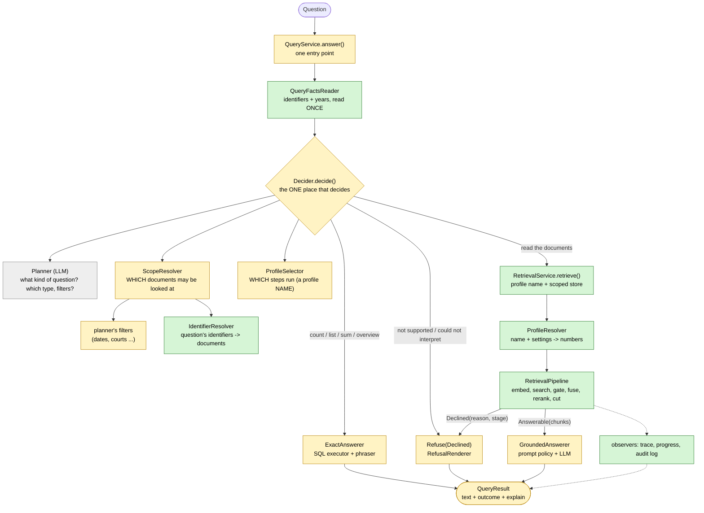
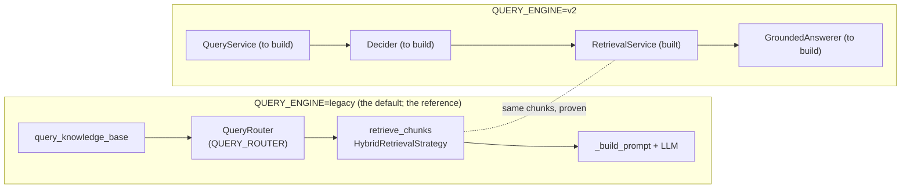

# Query pipeline: design of the rewrite

Status: **slice 1 (the retrieval) is implemented and proven equal to the original** on every characterization scenario and on a six-question live snapshot under five settings (see section 6 and `docs/decisions.md`, 2026-10-06); nothing in production uses the new pipeline except behind the temporary `QUERY_ENGINE=v2` switch. The decision side (slice 2) and the identifier resolver (section 8) are next.
It builds on `docs/query-workflow.md` (the as-is map and its tangles) and on an
independent design review (Opus, read-only) of the first draft. Items marked
**[to confirm]** are proposals that still need an explicit decision.

## 1. Goal and scope

Rewrite from zero the path *question → decision → retrieval → answer*, as small classes
with one responsibility each, so that "what happens where, when and why" is visible and
every refusal is attributable to a stage.

**In scope** (today: `QueryRouter`, `as_routed`, the identifier check, `retrieve_chunks`,
`HybridRetrievalStrategy.select_chunks`, `_build_prompt`'s policy flags, the four places
that decide "no answer").

**Kept as black boxes, reused unchanged:** `VectorStore`, `DocumentStore`, the embedding /
LLM / reranker drivers, the metadata planner / compiler / executor, `reciprocal_rank_fusion`,
`extract_years`, `extract_identifier_tokens`, `ResultPhraser`, ingestion, migrations.

**Not in scope until a measurement asks for it:** comparison, similarity retrieval,
map-reduce / document-level reading, per-question-kind profiles other than the default.
(The claim "top_k fails for synthesis" is a hypothesis here: top_k 8 did not help, the
refusal wording and the filter restriction did.)

The new code is built **beside** the old one, proven equal, then the old code is deleted.

## 2. Principles

1. One class, one reason to change. Flat modules under `query/`, one concept per file.
2. Steps never read `Settings`; parameters and collaborators arrive by constructor.
   `Settings` is read in exactly one place, the composition root (`build_query_service`).
3. Typed, explicit results: a refusal is a value (`Declined`), never an empty list.
4. Behaviour first, new features later: the new engine must reproduce today's retrieval
   exactly (characterization tests + `retrieval-snapshot --compare` IDENTICAL).
5. No silent fallbacks; every stage that cuts or refuses says so in the explain record.

## 3. Overview

### 3.1 The whole path, and how far it is built

Green = built and tested; yellow = still to build (slice 2); grey = exists and is reused as
it is (the planner, whose output is a `QueryPlan`). The retrieval half is done; the
decision half and the answering half are not. **Today's `QueryRouter` plus
`query_knowledge_base` do the work of the yellow boxes in one tangled piece, and stay as the
reference until the new ones are proven equal.**

### 3.2 What each box answers

| Box | The one question it answers | Today it lives in |
|---|---|---|
| `QueryFactsReader` | What plain facts does the question text hold (identifiers, years)? | detected in the router **and** in the retrieval |
| `Decider` | Which way does the question go: exact, refuse, or read? | `QueryRouter.route` |
| `Planner` | What kind of question is it, which type and filters? | `LLMQueryPlanner` (unchanged) |
| `ScopeResolver` / `Scope` | **Which documents** may the retrieval look at? | `Routing.selection` + `apply_routing` |
| `IdentifierResolver` | Which documents carry the identifier the question names? | the identifier pin (text search over chunks) |
| `ProfileSelector` | **Which steps** run? (a name: `hybrid`, `vector`, later others) | `RETRIEVAL_STRATEGY` read inside retrieval |
| `RetrievalService` | Run that profile over that scope: which chunks? | `retrieve_chunks` + `HybridRetrievalStrategy` |
| `GroundedAnswerer` | Write the answer from the chunks | `_answer_from_documents` + `_build_prompt` |
| `Declined` | Who refused, and why (a value, not an empty list) | four places, three wordings |

The two questions people mix up: **`Scope` is about documents** (decided from the metadata,
before any ranking), **a profile is about steps** (what the retrieval does inside the
scope). The retrieval decides neither: it receives both.

### 3.3 Three questions, followed through

*"What did the court decide in case 4.P.20.409/2023/4?"* (an identifier)
1. `QueryFactsReader`: identifiers = [`4.P.20.409/2023/4`].
2. `Decider`: the planner says "read". `IdentifierResolver` finds the one document that carries
   the number, so the **scope is that document**; the profile is the default.
3. `RetrievalService`: the pipeline runs over that document's chunks only. Nothing is pinned
   ahead of relevance, the ranking picks the best four.
4. `GroundedAnswerer` answers; the explain record says "identifier resolved to 1 document".

*"How many judgments did the Debrecen court give last year?"* (exact)
1. `Decider`: the planner says "count" with a court filter and a date range, covering the
   whole question.
2. `ExactAnswerer`: SQL counts, the phraser words it. **No retrieval at all.**

*"Which cases are similar to case X?"* (not supported yet)
1. `Decider`: the planner says "unsupported"; the answer is `Refuse(NOT_SUPPORTED)` with the
   planner's reason. No retrieval.

### 3.4 Where the original and the new meet

Today only the retrieval half exists on the right, reached through `retrieve_chunks` when
`QUERY_ENGINE=v2`; the decision and the answer are still the original's. Replacing the other
two boxes is slice 2, and then the left column is deleted.

Two entry methods share the same decision: `answer()` (full) and `retrieve()` (chunks only,
for the eval; the MCP search tool stays as it is).

## 4. Modules and classes

**Built:** `facts`, `outcome`, `context`, `step`, `candidate_steps`, `ranking_steps`, `gate_steps`, `selection_steps`, `profiles`, `runner`, `observers`, `legacy_trace`, `composition`, and `service.py` as far as `RetrievalService` and its request / result. **To build (slice 2):** `decision` (`Decision`, `Decider`, `Scope`, `ScopeResolver`, `ProfileSelector`), `answering` (`GroundedAnswerer`, `ExactAnswerer`, `AnswerPolicy`), the `RefusalRenderer` in `outcome`, and `QueryService.answer` with its `Explain`.

| Module | Contents |
|---|---|
| `query/facts.py` | `QueryFacts`, `QueryFactsReader` |
| `query/outcome.py` | `Answerable`, `Declined`, `DeclineReason`, `RefusalRenderer`, `ModelRefusalRecognizer`; the user-facing refusal texts move here |
| `query/decision.py` | `Decision` (tagged union), `Scope`, `Decider`, `PlanningDecider`, `UnplannedDecider` (temporary), `ScopeResolver`, `ProfileSelector` |
| `query/context.py` | `RetrievalContext` (the one shared, frozen context), `Slot` |
| `query/step.py` | `RetrievalStep` (the abstract contract of a step), `Continue` / `Halt` (`StepResult`), `AuxRecord`, `StepName` |
| `query/candidate_steps.py` | embed, dense search, year widening (dense / keyword), CSLS reorder, keyword search, identifier pin |
| `query/ranking_steps.py` | RRF fusion, rerank, listwise rerank |
| `query/gate_steps.py` | relevance gate (cosine), rerank-score gate |
| `query/selection_steps.py` | top-k with guarantees, cosine cut |
| `query/profiles.py` | `StepSpec`, `ProfileSpec`, `PROFILES`, `ProfileOverrides`, `ProfileResolver`, `StepRegistry`, `PipelineFactory` |
| `query/runner.py` | `RetrievalPipeline`, `StepObserver`, `TraceRecorder`, `AuditLogObserver`, `ProgressLogObserver`, `StageRecord` |
| `query/legacy_trace.py` | `LegacyTraceProjection`: reproduces today's `RetrievalTrace` keys exactly (deliberate, isolated debt) |
| `query/answering.py` | `AnswerPolicy`, `GroundedPromptBuilder`, `GroundedAnswerer`, `ExactAnswerer` |
| `query/service.py` | `QueryRequest`, `QueryService`, `QueryResult`, `RetrievalResult`, `Explain`, `build_query_service` |

### 4.1 Facts and decision
- `QueryFacts` (frozen): `question`, `identifiers`, `years`. The one place identifiers and
  years are detected; years are always computed, a profile decides whether they are used.
  This removes the duplicate identifier detection and the duck-typed `period_filter`.
- `Decision` is a tagged union: `ReadDocuments(facts, plan, profile, scope, anchors)`,
  `AnswerExactly(facts, plan)`, `Refuse(facts, declined)`.
- `PlanningDecider` = today's `QueryRouter.route` without executing or phrasing:
  planning failure → `Refuse(COULD_NOT_INTERPRET)`; `unsupported` → `Refuse(NOT_SUPPORTED)`;
  `as_routed`; exact operation → `AnswerExactly`; a lookup that names an identifier →
  unrestricted `ReadDocuments` with anchors; other lookups → `ScopeResolver`.
- `ScopeResolver` turns a lookup plan into a `Scope` (selection, metadata filter, note) or a
  `Declined(NO_MATCHING_DOCUMENTS)`.
- `ProfileSelector` chooses a profile **name**. One rule today: the configured default. The
  hook exists so the choice belongs to the decision step; no kind-of-question mapping is
  added before a second profile has been measured.
- `UnplannedDecider` serves `QUERY_ROUTER=false` and is deleted with the flag.

### 4.2 Outcome: one place for "no answer"
- `Declined(reason, stage, detail, note)`; `DeclineReason`: `COULD_NOT_INTERPRET`,
  `NOT_SUPPORTED`, `NO_MATCHING_DOCUMENTS`, `NOT_RELEVANT` (cosine gate), `RERANK_REJECTED`
  (cross-encoder gate).
- `RefusalRenderer` produces today's exact texts (both retrieval gates render
  `NO_RESULTS_MESSAGE`; they differ only in the explain record).
- `ModelRefusalRecognizer` recognises the model's own refusal sentence (same constant the
  prompt uses) and sets `explain.model_declined`; it never changes the text.
- The two retrieval gates are **not merged into one step**: they use different signals at
  different points (cosine before fusion, deliberately; cross-encoder after rerank). What
  is centralised is the type and the rendering, not the place.

### 4.3 Context and steps
- **One** frozen `RetrievalContext`, changed with `dataclasses.replace`: fixed `facts`, `scope`,
  and typed optional slots (`query_vector`, `dense_pool`, `keyword_pool`, `ranked`,
  `pins`, `selected`). Slot names describe *what* is held, not the phase that produced it
  (this avoids today's misnamed `listwise` key). New needs add a slot; each slot has one
  writer step. **Decided: slots.**
- `RetrievalStep`: `name`, `requires`, `provides` (sets of `Slot`), `run(context) -> StepResult`.
  `StepResult` is `Continue(state, records, notes)` or `Declined`. Order is validated when a
  profile is resolved (a mis-ordered profile cannot be built); about 30 lines.
- The runner is generic over the state type, so a later document-level state is possible
  without designing it now.

Steps that reproduce today's behaviour (names stable, parameters via constructor):

| Step | Replaces | Note |
|---|---|---|
| `EmbedQueryStep` | embed in `retrieve_chunks` | skipped when a vector is supplied |
| `DenseSearchStep(pool_size)` | `store.search(min_score=0.0)` | `pool_size = max(top_k, POOL_SIZE)` |
| `RelevanceGateStep(depth, min_score)` | `_passes_relevance_gate` | **before** year widening, on the unmerged pool |
| `YearDenseWideningStep` | years block | merge-unique, then stable sort by score |
| `CslsReorderStep` | `_csls_rerank` | stable; scores untouched; no hub score = raw score |
| `KeywordSearchStep` / `YearKeywordWideningStep` | `search_fulltext` | limit = `len(dense_pool)`; the year merge only appends, no sort |
| `RrfFusionStep` | `reciprocal_rank_fusion` | dense first, keyword second |
| `IdentifierPinStep(per_token)` | identifier rescue | pins = all matches; only new ones are prepended; ignores years and `metadata_filter` |
| `RerankStep` | `reranker.rerank` | sees the full list, pins included |
| `RerankScoreGateStep(min_score)` | the `isinstance(CrossEncoderRerankerDriver)` branch | keeps score ≥ min or pinned; empty → `Declined(RERANK_REJECTED)` |
| `ListwiseRerankStep` | `_maybe_listwise_rerank` | only when enabled |
| `TopKWithGuaranteesStep(top_k, diversify, year_quota)` | `_apply_top_k_with_guarantees` | rounds robin by `source_file`; guarantees capped at top_k; year reserve ⌈top_k/2⌉ |
| `CosineCutStep` | `VectorRetrievalStrategy` | |

`RerankStep` and `RerankScoreGateStep` are separate on purpose: `reranked` is recorded
between them and the second one can refuse. The score gate is included in a profile iff the
resolved reranker driver is the cross-encoder (this keeps today's class check without
touching the driver). The small pure helpers are **ported into the step that owns them**,
not imported from the old module; equality is proven by tests, not by shared code.

### 4.4 Profiles
- A profile is **data**: `ProfileSpec(name, steps: [StepSpec(kind, params, toggle)], measured)`;
  `measured` names the `decisions.md` entry and snapshot it was verified with.
- Profiles live only in the `PROFILES` registry (one Python module). `.env` selects a
  **name**; the existing flags are typed overrides applied in one `ProfileResolver`, so each
  flag fans out in one visible place (`DIVERSIFY` → identifier pin + top-k; `PERIOD_FILTER`
  → both widening steps + the year quota). No step lists in `.env`/YAML, no runtime
  composition: every combination would be an unmeasured pipeline.
- Shipped profiles: `hybrid` (embed, dense, gate, [year dense], CSLS, keyword, [year
  keyword], RRF, identifier pin, rerank, [score gate], [listwise], top-k) and `vector`
  (embed, dense, gate, cosine cut). Resolved profiles have a fingerprint, recorded in the
  explain record.
- `PipelineFactory` builds a pipeline **per query**: the store is scoped per query
  (`restricted_to(selection)`), so it cannot be fixed in a step at start-up.
- `ProfileOverrides` replaces today's constructor overrides and the `top_k` override used by
  the eval tools; `top_k` still moves the gate depth and the pool size (kept for now).
- This resolves the open disagreement as a middle way: profiles are data, as asked, but only
  registered, measured ones are valid. **[to confirm]**

### 4.5 Runner, observer, trace
- `RetrievalPipeline.run(state, observer)` opens one store session, asserts the embedding
  dimension, runs steps in order, stops at the first `Declined`.
- Cross-cutting concerns are an **observer called by the runner** around every step, not
  decorators on each step: `TraceRecorder` (uniform `StageRecord`s), `AuditLogObserver`
  (same `LogAction` payloads as today), `ProgressLogObserver`.
- **Retries stay in the drivers** (`retry_policy`). A step-level retry decorator would
  multiply attempts and stretch stalls.
- `LegacyTraceProjection` maps the records onto today's trace keys, quirks included
  (`fused` is the output of the identifier pin; `listwise` is the list entering selection;
  `final` is `[]` after a late decline and absent after the relevance gate), so `funnel`,
  `retrieval-snapshot` and the characterization tests read an unchanged contract. Renaming
  `listwise` → `pre_selection` is a later, announced re-baseline.

### 4.6 Answering and the service
- `AnswerPolicy(partial_coverage, expose_document_date)`; `GroundedPromptBuilder` must be
  byte-identical to today's `_build_prompt` (tested for both flag values). One driver change
  is needed later: `AnswerDriver.generate(system, user)` with `answer()` as a wrapper; it
  comes after the switch, not in the first slice.
- `GroundedAnswerer` (driver + prompt builder + refusal recognizer), `ExactAnswerer`
  (executor + phraser). There is no "unsupported answerer": that case is a `Declined`.
- `QueryService.answer(request) -> QueryResult(text, outcome, explain)` and
  `retrieve(request) -> RetrievalResult`. `query_knowledge_base` and `retrieve_chunks`
  remain as thin wrappers so existing callers keep their signatures.
- `Explain` (typed): facts, decision, profile fingerprint, stage records, notes, final chunk
  ids, `model_declined`, timings. The eval and `funnel` will read it instead of
  re-running retrieval (a later, separate commit: it changes how the eval measures).

### 4.7 MCP and the single entry (**decided: out of scope for now**)
The MCP `search` tool keeps calling `retrieve_chunks` unchanged; what it should become is
left open. For reference, the option considered: the MCP `search` tool uses `QueryService.retrieve()`, the same decision as `answer()`:
documents → excerpts as today; an exact decision → one `exact_result` item; could-not-
interpret / not-supported / no-matching → an explicit tool error; the two retrieval gates →
`[]` (today's contract). Cost: one planner LLM call per MCP search, and a changed response
contract. Therefore its own commit, behind the router flag.

## 5. Parity traps (each pinned by tests or `decisions.md`)

1. The gate looks at the **unmerged** dense pool, depth = `top_k`, `>=`, before year widening.
2. The two declines leave different traces (see 4.5).
3. Keyword and identifier limits are `len(dense_pool)` **after** the year merge, not the pool
   size (a later, deliberate-change candidate, kept as is).
4. The dense year merge sorts (ties: primary first); the keyword year merge only appends.
5. CSLS: stable, scores untouched, missing hub score = raw score.
6. RRF: dense list first, `setdefault` keeps the dense chunk object, ranks from 1, k = 60.
7. Identifiers are read from the raw question; the identifier search ignores `metadata_filter`
   and years but honours the store restriction.
8. The reranker sees the whole fused list; the score gate keeps `score >= min or pinned`;
   with the dev `.env` (`RERANKER_DRIVER=vertex`) the gate never runs live, so the parity
   run must be repeated with `RERANKER_DRIVER=cross_encoder`.
9. Listwise runs on the post-gate list; it is LLM-nondeterministic, so compare it with a
   stubbed disambiguator or only up to `reranked`.
10. Selection groups by `source_file`; guarantees capped at `top_k`; output order:
    guaranteed, year extras, the rest; the vector profile never uses years.
11. `metadata_filter` reaches dense, keyword and both year searches, never the identifier
    search.
12. Router texts: `"\n\n"` before an appended note on answers, `" "` inside "No documents
    match"; the wording that `decline_detection` relies on must not change.
13. One store session for the whole run; `restricted_to` is created before it opens; the
    embedding driver is still constructed when a query vector is supplied (its dimension is
    used).
14. The characterization harness patches module globals of `query.retrieval`; the new engine
    takes everything by injection, so the harness gets a second runner per engine with the
    expected results unchanged.

## 6. Build plan

**Slice 1 – retrieval only, no user-visible change: DONE** (commits `e6d7739`, `a710672`,
`a98f612`, and the funnel `eec1a0f`; the evidence and what the tests missed are in
`docs/decisions.md`, 2026-10-06)
1. The characterization harness runs every scenario on an engine-neutral description.
2. Facts, outcome types, context, step contract, runner, trace recorder, legacy projection.
3. The vector profile's steps and profile.
4. CSLS, keyword, RRF, identifier pin, rerank, score gate, top-k.
5. Year widening, year quota, listwise.
6. `RetrievalService.retrieve`, `build_retrieval_service`, the temporary `QUERY_ENGINE`.
   Live gate: the original engine identical to itself, then `--compare` v2 IDENTICAL on six
   questions under five settings (default, period filter, vector profile, cross-encoder,
   and all three together); restricted retrieval identical on the real database too.

Also built: the observers (progress and audit log), and a `funnel` that reads the step
records (per step in / out / time / which step dropped a golden document).

**Slice 2 – the decision side: not started.** The decider (port the router test cases), the
`Scope`, `QueryService.answer` behind the flag, golden eval on both engines (retrieval
identical, answers within LLM noise), then the switch. The identifier and date resolvers
(section 8) come first inside it; the MCP stays out.

**End:** delete the legacy code and `QUERY_ENGINE`; the eval and `funnel` read `explain`;
the prompt-builder driver change.

**Deleting `QUERY_ROUTER` and `ANSWER_PARTIAL_COVERAGE` is not part of the refactor.** Both
default to *off*, so deleting them changes the default behaviour. Each is its own measured
commit after parity, conditioned on the full `--repeat 3` golden run.

Left out of the first slice: prompt builder and driver change, decider, MCP, kind-of-question
profiles, trace key renames, map-reduce, comparison, similarity.

## 7. Risks

- Listwise nondeterminism blocks an "IDENTICAL" claim for that step (see trap 9).
- The score gate is unexercised live under `vertex` (trap 8).
- Eval numbers shift slightly once the eval stops retrieving twice: a measurement change,
  its own commit.
- Over-engineering: keep requires/provides to an enum plus about 30 lines; no YAML, no
  decorator layer, no plugin registry, typed `Explain` (not a dict).
- Two pipelines must not live side by side for long: the flag, the parity proof and the
  deletion of the old code are the definition of done.

## 8. Facts resolved into the scope

Today neither the identifier nor the date reaches the retrieval from the metadata: the
planner's filters (over `document_meta`) become the restriction of the store, while the
retrieval has its own regex facts (`extract_years` filters the chunk's `document_date`;
identifier tokens drive `search_by_identifier`). Two mechanisms, one narrowing and one
widening or pinning.

**What is `Scope` for?** It answers "which documents may the retrieval look at?", and it is
produced on the decision side (from the metadata) so that the steps stay ignorant of why:
they only see a store restricted to those documents (`store.restricted_to(selection)`). It
is the one place where the sources combine (the planner's filters, the identifier
resolver, the dates), it carries the honest parts (the note "N documents could not be
checked against the filter", and an **empty scope is an explicit `Declined`**, never a
silent empty search), and today it exists, unnamed, as `Routing.selection` and
`Routing.note` plus `apply_routing`.

**Built (commit `4267c39`).** The value type `identifier` and the one rule for comparing
identifiers (`metadata/identifiers.py`, repeated in the compiled SQL and held equal by a
database test): both sides normalised (compatibility form, lower case, no whitespace, no
`./-,;:` at the ends); a stored identifier matches a wanted one when they are equal or it
continues the wanted one with something that is not a digit (a suffix). `document_identifier`
is now of this type, and it is extracted by the model (from 2224 documents; it used to be
copied from the first 100 characters of the text, which holds the header's number but not
the case number a decision states further down).

**To build, measured, never as part of the parity slices:**
- `IdentifierResolver`: the identifiers of the question (`QueryFacts.identifiers`) against
  every key of type `identifier`; per identifier a **set** of document ids (zero, one or
  several: nothing is picked between documents that share a number; ranking decides by
  content). The scope is the union; between kinds of fact the combination is AND, within one
  kind OR (several identifiers, several periods; a set of periods is one `in` filter on the
  date key, a change that already exists in the compiler).
- With a resolved scope every candidate is already from those documents, so the
  **identifier pin is not needed and is to be deleted**, not commented out: it forces every
  chunk that carries the number (all of a document's chunks do) into the context ahead of
  relevance, and, when the named document is absent, it pins the documents that merely *cite*
  the number and so misleads. Deleting it also removes the `PINS` slot, the guaranteed slots
  in the top-k cut, the pin's exemption from the reranker's score gate, and the two effects of
  `RETRIEVAL_DIVERSIFY_GUARANTEES`. An identifier that resolves to no document is then said
  plainly ("no document has that identifier"), which is also the right handling of an
  invented number.
- **Order:** the resolver and the scope first (without them the new engine would lose the
  pinpoint ability), then measure the nine questions that name an identifier and the
  single-document personas (fact_finder, adversarial, practical) without the pin, then
  delete it. The characterization scenarios with an identifier then get a new, explained
  expectation for the new engine only.
- **Open, to measure:** when the plan already narrows by date, does the regex year widening
  (`YearDenseWideningStep`, the year quota) still add anything?

## 9. Decisions still needed

Decided: MCP stays out for now (4.7); state uses named slots (4.3); `QUERY_ENGINE` exists
only for testing (6).

Still to confirm: profiles as the middle way in 4.4 (data, registered and measured only).
