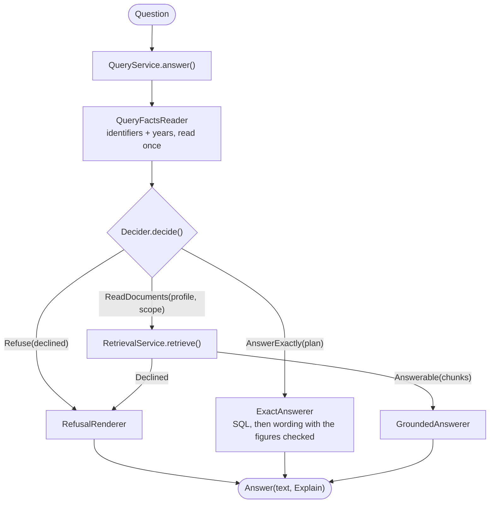

# Query pipeline: design

What happens between a question and its answer, and why it is split the way it is. This
document describes the code as it is. How it got here (the single-method original, the
parity proofs, the measurements, the dead ends) is in `docs/decisions.md`, entries from
2026-10-06 to 2026-10-08; the setting-by-setting numbers are in `docs/architecture.md`.

## 1. Goal

Answer a question about the ingested documents, and make every step of "what happened,
where and why" visible: no refusal without a named stage, no document read that the
decision did not allow, no answer without a record of how it came about.

The path is *question → decision → (retrieval →) answer*. Ingestion, the metadata
catalog and extraction, and the drivers (embedding, language model, reranker) are used as
they are; this document is about `query/`.

## 2. Principles

1. **One class, one reason to change.** Flat modules under `query/`, one concept per file.
2. **Settings are read in one place**, the composition root (`query/composition.py`).
   Steps and services take what they need by constructor.
3. **A refusal is a value** (`Declined(reason, stage, detail, note)`), never an empty
   list. Each stage that cuts or refuses says so in the explanation.
4. **No silent fallbacks.** A corpus without an approved document type fails loudly; a
   filter that selects nothing is a refusal, not a read of everything; a plan that no
   longer fits the catalog is an error.
5. **The core is generic.** Nothing in `query/` knows the court corpus; corpus specifics
   live in `corpus/` (tools, data) and in the language layer (`query/inflection.py`).
6. **Profiles are data.** A retrieval profile is a registered, ordered list of steps;
   only measured profiles are registered.
7. **Cross-cutting concerns are observers**, not decorators on every step; retries stay
   in the drivers.

## 3. The path

A caller can fix the scope itself (`answer(..., scope=...)`; the agent's `source_file`
does): nothing is decided then, the documents inside the scope are read. A caller can also
name a profile (`profile=...`, for comparisons); that changes how the documents are read,
not what was decided.

### 3.1 What each box answers

| Box | The one question it answers | Module |
|---|---|---|
| `QueryFactsReader` | What plain facts does the question text hold (identifiers, years)? | `facts.py` |
| `PlanningDecider` | Which way does the question go: exact, refuse, or read? | `decision.py` |
| `LLMQueryPlanner` | What kind of question is it, over which type and filters? | `metadata/planner.py` |
| `ScopeResolver` / `Scope` | **Which documents** may the retrieval look at? | `decision.py` |
| `IdentifierResolver` | Which documents carry the identifier the question names? | `metadata/identifier_resolver.py` |
| `ProfileSelector` | **Which steps** run? (a profile name) | `decision.py` |
| `RetrievalService` | Run that profile over that scope: which chunks? | `service.py` |
| `GroundedAnswerer` | Write the answer from the chunks | `answering.py` |
| `ExactAnswerer` | Run an exact plan and word the result | `answering.py` |
| `RefusalRenderer` | What is the person told when there is no answer? | `outcome.py` |
| `QueryService` | Connect them in the one order there is, and explain | `query_service.py` |

The two questions people mix up: **`Scope` is about documents** (decided from the
metadata, before any ranking), **a profile is about steps** (what the retrieval does
inside the scope). The retrieval decides neither; it receives both.

### 3.2 Three questions, followed through

*"What did the court decide in case 4.P.20.409/2023/4?"* (an identifier)
1. Facts: identifiers = [`4.P.20.409/2023/4`].
2. The planner says "read". The `IdentifierResolver` finds the document(s) that carry the
   number, so the **scope is those documents**; the profile is the default.
3. The retrieval runs over those documents' chunks only. Nothing is forced into the
   context; the ranking picks the best four. If the question names several documents, the
   final cut takes turns across them, so each is represented.
4. The grounded answerer answers; the explanation says what the identifier resolved to.

*"How many judgments did the Debrecen court give in 2021?"* (exact)
1. The planner says "count" with a court filter and a date range covering the whole
   question: `AnswerExactly`.
2. `ExactAnswerer`: SQL counts (stating the executed filter and how many documents could
   not be decided), the phraser words it, every figure is checked. No retrieval.

*"Which cases are similar to case X?"* (not supported yet)
1. The planner says "unsupported": `Refuse(NOT_SUPPORTED)` with the planner's reason.
   No retrieval, and no pretence that a search could do it.

## 4. Modules

| Module | Contents |
|---|---|
| `facts.py` | `QueryFacts`, `QueryFactsReader` |
| `inflection.py` | `strip_case_ending` (the Hungarian language layer for identifiers) |
| `outcome.py` | `Answerable`, `Declined`, `DeclineReason`, `RefusalRenderer`, the fixed refusal sentences |
| `decision.py` | `Decision` (`ReadDocuments` / `AnswerExactly` / `Refuse`), `Scope`, `ScopeResolver`, `PlanningDecider`, `ProfileSelector`, `as_routed`, `scope_of_source_file` |
| `context.py` | `RetrievalContext` (one frozen context), `Slot` |
| `step.py` | `RetrievalStep` (the contract), `Continue` / `Halt`, `AuxRecord`, `StepName` |
| `candidate_steps.py` | embed, dense search, year widening (dense and keyword), CSLS reorder, keyword search |
| `ranking_steps.py` | RRF fusion, rerank, listwise rerank |
| `gate_steps.py` | the relevance gate (cosine) and the reranker's score gate |
| `selection_steps.py` | the final cut with the year quota and the spread over named documents |
| `profiles.py` | `StepSpec`, `ProfileSpec`, `PROFILES`, `DEFAULT_PROFILE`, `Condition`, `ProfileResolver`, `PipelineFactory` |
| `runner.py` | `RetrievalPipeline`, `StepObserver`, `TraceRecorder`, `StageRecord` |
| `observers.py` | `AuditLogObserver`, `ProgressLogObserver`, `CompositeObserver` |
| `service.py` | `RetrievalRequest`, `RetrievalResult`, `RetrievalService` |
| `answering.py` | `GroundedAnswerer`, `AnswerPolicy`, `ExactAnswerer`, `ResultPhraser`, `render_result` |
| `query_service.py` | `QueryService`, `Answer`, `Explain` |
| `knowledge_base.py` | `query_knowledge_base` (the agent's entry), `search_knowledge_base` (passages only, for the MCP) |
| `composition.py` | `build_retrieval_service`, `build_planning`, `build_query_service` |

Reused as they are (not part of the pipeline's own structure): `hybrid.py` (RRF),
`listwise_rerank.py`, `time_filter.py` (`extract_years`), `decline_detection.py`.

### 4.1 Decision and scope

- `Decision` is a tagged union: `ReadDocuments(facts, plan, profile, scope)`,
  `AnswerExactly(facts, plan)`, `Refuse(facts, declined)`. The decider returns it and
  does nothing else: it neither runs the plan nor words the refusal.
- `PlanningDecider`: planning failure → `Refuse(COULD_NOT_INTERPRET)`; `unsupported` →
  `Refuse(NOT_SUPPORTED)` with the planner's reason; `survey` (the practice, the kinds of
  cases or the outcomes across many documents the question does not name, picked by topic
  or content) → `Refuse(SURVEY_NOT_YET)` until a profile that reads that many documents
  exists, except that a survey which names an identifier is read like a lookup; an exact plan covering the whole
  question → `AnswerExactly`; an exact plan with a residual (a condition no key covers)
  is read like a lookup (`as_routed`); a lookup → the scope, and the profile.
- **Scope rules** (`ScopeResolver`): several identifiers give the union of their
  documents; a resolved identifier wins over the planner's filters (a note says so when
  they disagree); identifiers that resolve to nothing leave the retrieval unrestricted and
  the filters are *not* applied (the note says so; a restriction could only exclude the
  document that was named); notes name identifiers found only as a part of a longer one or
  with other separators; filters alone narrow; a filter that selects nothing is
  `Declined(NO_MATCHING_DOCUMENTS)`; an identifier that is only punctuation names nothing.
  `Scope.names_several_documents` tells the retrieval to take turns across documents.
- **Identifier resolution** (`metadata/identifier_resolver.py`): in up to three steps,
  each only for what the earlier ones did not find: as written (equal after
  normalisation, or continued by a non-digit suffix; a short wish only when equal), as a
  part of a stored identifier (the leading series left out), and with the separators
  ignored. The last two need a wish that says enough (not `4.P`, not a date, not a short
  bare number) and are reported as approximate. Per identifier the result is a *set* of
  documents; nothing is picked between documents that share a number. The rule exists in
  Python, in SQL and as a regex, held equal by database tests.
- `ProfileSelector` chooses a profile **name**; today it always returns `DEFAULT_PROFILE`.
  The decision is the one place where that choice is made.

### 4.2 Outcome: one place for "no answer"

- `DeclineReason`: `COULD_NOT_INTERPRET`, `NOT_SUPPORTED`, `SURVEY_NOT_YET`,
  `NO_MATCHING_DOCUMENTS`, `NOT_RELEVANT` (cosine gate), `RERANK_REJECTED` (cross-encoder
  gate).
- `RefusalRenderer` words each; both retrieval gates say the same to the person
  (`NO_RESULTS_MESSAGE`) and differ only in the explanation. The wording is fixed because
  the eval's decline detection (`decline_detection.py`) and the adversarial questions
  read it.
- The two retrieval gates are **not merged**: different signals at different points
  (cosine before fusion; the reranker's score after the rerank). What is shared is the
  type and the rendering.
- The model's own refusal is recognised by the fixed sentence at the start of its reply
  (`GroundedAnswer.refused`); the text is never changed.

### 4.3 Context and steps

- **One** frozen `RetrievalContext`: fixed `facts`, `metadata_filter`, `spread_documents`,
  and typed optional slots (`query_vector`, `dense_pool`, `keyword_pool`, `ranked`,
  `selected`). A slot is named for *what* it holds, not for the phase that produced it.
- `RetrievalStep`: `name`, `requires`, `provides` (sets of `Slot`),
  `run(context) -> Continue | Halt`. A step returns a changed copy
  (`context.with_slots(...)`); it can only write what it declared. `RetrievalPipeline`
  validates the chain when it is built (a step whose input nothing provides, or a chain
  without the selected chunks, is refused) and stops at the first `Halt`.

| Step | What it does | Note |
|---|---|---|
| `EmbedQueryStep` | embeds the question | skipped when a vector is supplied |
| `DenseSearchStep` | vector search over the candidate pool | `pool_size = max(top_k, POOL_SIZE)` |
| `RelevanceGateStep` | refuses when nothing is similar enough | cosine, on the **unmerged** pool, depth `top_k`, `>=`, before year widening |
| `YearDenseWideningStep` | adds a second pool restricted to the question's years | merge, then stable sort by score |
| `CslsReorderStep` | demotes generic, boilerplate-like chunks | stable; scores untouched; no hub score = raw score |
| `KeywordSearchStep` | full-text pool | limit = size of the dense pool |
| `YearKeywordWideningStep` | the same for the keyword pool | the merge only appends |
| `RrfFusionStep` | reciprocal rank fusion | dense list first, k = 60 |
| `RerankStep` | re-scores the whole fused list | |
| `RerankScoreGateStep` | drops what the reranker scored too low; refuses if nothing is left | only with a cross-encoder reranker |
| `ListwiseRerankStep` | optional LLM re-ordering | only when enabled |
| `TopKWithGuaranteesStep` | the final cut | reserves half the slots for the question's years; takes turns across documents when the question names several |

`RerankStep` and `RerankScoreGateStep` are separate on purpose: the reranked list is
recorded between them and the second one can refuse.

### 4.4 Profiles

- A profile is `ProfileSpec(name, steps, measured)`; `steps` are `StepSpec(kind, when)`
  where `when` is a `Condition` decided from the settings (`PERIOD_FILTER`,
  `CROSS_ENCODER`, `LISTWISE`). `measured` names where the profile was verified.
- One profile is registered: **`best_chunks`** (embed, dense, gate, [year dense], CSLS,
  keyword, [year keyword], RRF, rerank, [score gate], [listwise], top-k). The name says
  what the answer is built from.
- `ProfileResolver` turns a profile name and the settings into numbers (`RetrievalParams`)
  and the list of steps that apply; `PipelineFactory` builds the pipeline **per query**,
  because the store is restricted per query (`restricted_to(selection)`).
- No step lists in `.env`, no runtime composition: every combination would be an
  unmeasured pipeline.

### 4.5 Running, observing, recording

- `RetrievalService.retrieve(request, store)` owns the store session (`with store:`,
  dimension check), restricts the store to the scope's selection, builds and runs the
  pipeline, and returns `RetrievalResult(outcome, records, scope)`.
- Observers are told after every step: `TraceRecorder` keeps a `StageRecord` per step
  (what went in, what came out, side results, notes, seconds, the refusal),
  `AuditLogObserver` writes the gate and rerank events, `ProgressLogObserver` the
  progress lines. Steps never log.
- Retries stay in the drivers (`retry_policy`). A step-level retry would multiply
  attempts and stretch stalls.

### 4.6 Answering and the service

- `GroundedAnswerer(driver, AnswerPolicy)` builds the prompt with
  `drivers.llm._build_prompt` and asks `AnswerDriver.generate(system, user)`.
  `AnswerPolicy` carries whether the excerpts' dates are shown. The refusal rule is the
  strict one: the model refuses with a fixed sentence when the excerpts do not answer.
- `ExactAnswerer(executor, phraser)` runs the plan once and words the result. The model
  only *words* it: every figure must reappear unchanged, otherwise the plain facts are
  returned (`ResultPhraser`).
- `QueryService.answer(question, *, top_k, min_score, profile, scope, store)` returns
  `Answer(text, Explain)`. `Explain` holds the decision, the retrieval result (records),
  the refusal if any, whether the model refused, and `chunks` (what the answer was written
  from). The golden eval reads it (`chunks` are what it grades); `funnel` reads the retrieval records. A scope note is appended to the text after
  a blank line.
- Entry points: `query_knowledge_base` (the agent, its CLI), `search_knowledge_base` (the
  MCP: the retrieval service only, no planner, no answer).

## 5. Invariants the tests pin

These are properties a change must not break silently; the characterization scenarios
(`tests/unit/query_pipeline/test_retrieval_characterization.py`) and
`retrieval-snapshot` hold them. Changing one is allowed, on purpose, with the measurement
that justifies it.

1. The relevance gate looks at the unmerged dense pool, before year widening.
2. The keyword search's limit is the dense pool's size after the year merge.
3. The dense year merge sorts; the keyword one only appends.
4. RRF puts the dense list first and keeps the dense chunk object.
5. `metadata_filter` reaches the dense, keyword and both year searches.
6. The reranker sees the whole fused list; the score gate drops by score only.
7. Refusal texts: a note is appended after a blank line; the sentences read by
   `decline_detection` do not change.
8. One store session per retrieval; the embedding dimension is checked even when a query
   vector is supplied.
9. The listwise step is nondeterministic (a language model): compare up to the reranked
   list, or stub it.
10. With the development `.env` (`RERANKER_DRIVER=vertex`) the score gate never runs live:
    it is covered by tests and by a run with `RERANKER_DRIVER=cross_encoder`.

## 6. Measuring

| Tool | What it tells you |
|---|---|
| `corpus/cli.py eval` | answer, retrieval hit and citation per persona on the golden set (through `QueryService`) |
| `corpus/cli.py retrieval-snapshot` | the chunk ids every step left, per question; `--compare` lists every difference |
| `corpus/cli.py funnel` | per question, per step: in, out, time, which step dropped a golden document |
| `corpus/cli.py routing-eval` | does the decider choose the right flow, and does a restriction select any document |
| `corpus/cli.py meta-plan-eval` | the planner and compiler on generated count/list questions |

A snapshot records the settings that shape retrieval, including the embedding and
reranker model, and refuses to call two snapshots comparable when they differ.

## 7. Open

- **Questions about many documents** ("what kinds of cases did X and Y decide between
  2020 and 2022"). Four chunks from about three documents cannot answer them, and the
  candidate list holds only about a third of the golden documents (numbers in
  `docs/decisions.md`, 2026-10-08). **Recognised since 2026-10-08, not answered:** the
  planner has a `survey` operation and the decision says plainly that this kind of
  question is not supported yet (see 4.1). What is left is the reading itself: a second
  profile that reads documents rather than chunks (`document_survey`), selected by the
  same decision that now refuses. To decide: how many documents it may read (cost and
  time); the yardstick is `independent_fact` and the number of different relevant
  documents, with `exact_match` as a completeness check once the path is exhaustive.
- The `ANSWER_GENERATED` audit event is not written on this path.
- Which document type a question is about is taken from the planner's reading of the
  approved types' descriptions; inferring it per document (a stored type, a classifier)
  is not designed.
- When the plan already narrows by date, does the regex year widening
  (`YearDenseWideningStep`, the year quota) still add anything? To measure.
